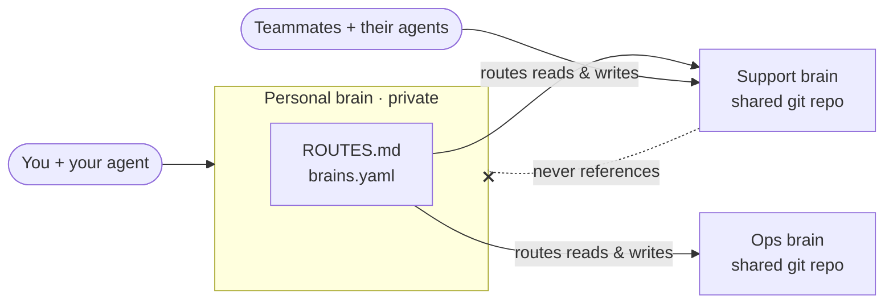
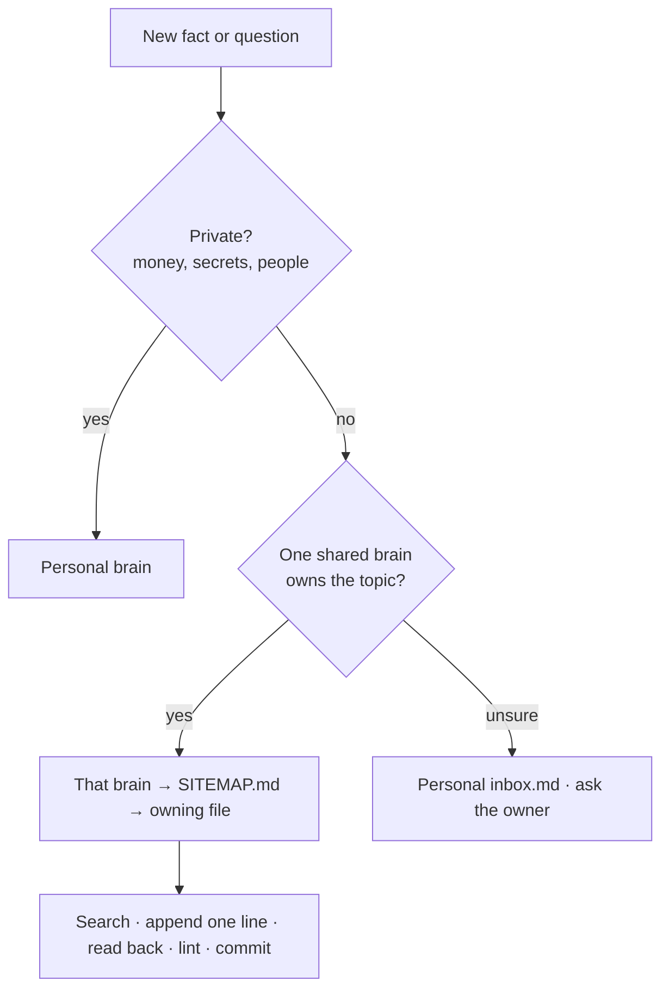

# Membrain

**Shared memory for your AI agents: markdown "brains" that Cursor, Claude Code, Grok and other agents read before they answer and write to when they learn, with your private notes kept private.**


<sub>Your personal brain knows about every shared brain. Shared brains never know your personal brain exists.</sub>

## Why it exists

**The problem.** AI agents forget everything between chats. What your team knows is scattered across chat threads, docs and people's heads. When you do give agents notes, private things (prices, salaries, client terms) end up next to shareable ones, and agents give stale or duplicate answers because nobody knows which note is current.

**The goal.** One place per topic that every agent reads first, that people and agents both keep up to date, and that can be shared with a team without leaking anything private.

**What you can achieve**

- **One source of truth.** Any agent, yours or a teammate's, answers from the same file and tells you which file it opened.
- **Hand work to AI.** Agents look up known fixes, draft replies and record what they learned, so people stop answering the same question twice.
- **Fast onboarding.** A new teammate points their agent at a shared brain and is productive on day one.
- **Private stays private.** Everything starts in your personal brain. A lint blocks prices, secrets, emails and any mention of your personal brain from reaching a shared one.
- **Fresh, deduplicated knowledge.** One-line dated entries, duplicate detection, stale-date checks, and a sitemap that says when each file was last checked.

**Why this and not…**

| Instead of | What you'd miss |
|---|---|
| A plain notes folder | No routing (agents don't know where to look or write), no privacy check, no duplicate or staleness checks, no rules agents follow. |
| Notion or a wiki | Agents need connectors to read it and rarely write back well; no per-line history or review; private and shared pages live in one workspace. |
| A vector DB or memory service | Opaque to people, hard to review or correct, and it retrieves fragments instead of the one file that owns the fact. Membrain is plain markdown in git: readable, diffable, yours. |

You can still use search tools (for example [qmd](https://github.com/tobi/qmd)) on top of Membrain brains.

**Who it's for**

- Solo founders and operators who want their agent to remember how things are done.
- Small teams who want every member's agent to give the same answer.
- Support and ops teams building a playbook of known fixes.
- Consultants who keep one shared brain per client and their own notes apart.
- Developers already working in Cursor or Claude Code.

## How a team uses it

1. **The owner spins off a shared brain** from their personal brain (for example `support`). The agent shows which files would move and the privacy check result before moving anything.
2. **The owner invites teammates** to that brain's git repo. Only that repo; nobody sees the personal brain.
3. **Each teammate points their own agent at it**: clone the repo, then "Read CLAUDE.md in this folder and follow it."
4. **Agents append what they learn** as one-line entries in the file that owns the topic, following the brain's rules. Anything unsure goes to the brain's `inbox.md`.
5. **Lint runs weekly** (and on every commit and in GitHub Actions): privacy leaks, duplicates, stale deadlines, broken sitemap links.
6. **The owner approves** inbox items and structure changes. Nothing in the inbox lands in the brain until a person says yes.
7. **Personal brains stay private.** Each person's own notes, prices and opinions never leave their machine or private repo.

**Example: a support team's brain.** A customer reports that their weekly report email arrives empty. The support agent opens `support/SITEMAP.md`, sees that `playbook/fixes.md` owns known fixes, and finds:

```
- Weekly report email arrives empty → the report filter still says last month; set it to "this week" · Client B · 2026-10-06 · @alice · verified · src:T-101
```

It drafts the reply for a person to send. A week later the product changes and the filter resets itself, so another teammate's agent appends a new line instead of editing Alice's. Lint keeps the client's contract price out of the brain, and the owner's private note about that client stays in the owner's personal brain.

## Quickstart

You need an AI agent that can read URLs and run commands (Cursor, Claude Code, Grok or similar), plus `git` and Python 3. Paste this as your first message:

```text
Read https://github.com/jiacai-lau/membrain/blob/main/MEMBRAIN.md (raw: https://raw.githubusercontent.com/jiacai-lau/membrain/main/MEMBRAIN.md) and follow section A to set up Membrain for me. Don't clone the repo; generate my workspace from its templates. Ask me the setup questions in one message, keep my personal brain local and private, and don't push anything without my OK.
```

Your agent asks four or five questions (your handle, workspace folder, GitHub account, other names your notes go by, notes to import), generates the workspace, runs a self-test and makes a local private git repo for your personal brain. It shows you the `gh repo create … --private` command and runs it only if you say so.

<details>
<summary>No agent? Run the same setup with Python.</summary>

```bash
curl -fsSL https://raw.githubusercontent.com/jiacai-lau/membrain/main/scripts/bootstrap.py \
  | python3 - --base https://github.com/jiacai-lau/membrain --workspace ~/membrain --owner <you>
```
Standard library only. Produces the same workspace as section A.
</details>

## What you get

```
~/membrain/                    your workspace (not a git repo)
├── AGENTS.md  CLAUDE.md       rules every agent reads first
├── START-HERE.md              copy-paste prompts for you, teammates and scheduled jobs
├── .cursor/rules/membrain.mdc Cursor picks up the same rules
├── .membrain.yaml             Membrain version + file hashes, used for upgrades
├── docs/                      entry format, privacy rules, sitemap format
├── scripts/                   lint, router, spin-off, upgrade, pull-all
└── brains/
    ├── personal/              PRIVATE git repo
    │   ├── ROUTES.md          which brain owns which topic
    │   ├── brains.yaml        registry of your brains (ROUTES.md is generated from it)
    │   ├── SITEMAP.md         which file owns which kind of fact, last changed / last checked
    │   ├── STATE.md           TLDR and the one next task
    │   ├── inbox.md           proposed lines waiting for your decision
    │   └── howto/ projects/ pointers/ handoffs/
    └── support/               a spun-off shared brain: its own git repo, rules, sitemap and lint
```

## How it works


<sub>How an agent decides where a note goes. Reads follow the same route: the owning brain first, then personal for private context.</sub>

- **Brains** are folders of markdown, each its own git repo. Everything starts in the **personal brain**; you **spin off** a shared brain when a topic is worth sharing.
- **Routing** lives only in the personal brain (`ROUTES.md`, `brains.yaml`), because it has to name the personal brain.
- **Privacy is one-way**: personal may point to shared; shared never references personal. Lint enforces it.
- **Each brain has a `SITEMAP.md`**: which file owns which kind of fact, plus "last changed" and "last checked" dates.
- **Entries are append-only one-liners** with a date, an `@owner` and a status. To retire one, append ` · SUPERSEDED <date>: <reason>`; never delete.
- **Agents verify their writes**: read the file back, run lint, then say "saved".
- **Sync hooks** for Claude Code and Cursor pull a brain when it's stale and push when it changed. A **monthly log** records what happened in a greppable format.
- **Upgrades touch framework files only.** Your agent compares the stamped `membrain_version` and file hashes, shows you what would change, and never rewrites your notes.

More in [docs/concepts.md](docs/concepts.md).

## Usage prompts

| Task | Prompt to paste | Your agent… | …and never, without your OK |
|---|---|---|---|
| Set up | The [Quickstart](#quickstart) prompt (MEMBRAIN.md section A) | asks setup questions, generates the workspace, self-tests, creates a local private personal brain | pushes or creates a remote repo |
| Spin off | `Read AGENTS.md in my Membrain workspace, then follow section B of https://raw.githubusercontent.com/jiacai-lau/membrain/main/MEMBRAIN.md to spin off a shareable brain called <name> for <purpose>. Show me which files would move and the privacy check result before moving anything, and don't create the GitHub repo or invite anyone until I say so.` | shows the move list, privacy-checks each file, creates the new brain and its route | moves a blocked file, creates the repo, invites anyone |
| Upgrade | `In my Membrain workspace, follow section C of https://raw.githubusercontent.com/jiacai-lau/membrain/main/MEMBRAIN.md: run the upgrade dry run, show me the changelog and the proposed framework file changes, and apply only after I say OK. Never overwrite my content files.` | dry-runs, shows the changelog and each proposed file change | applies changes or touches your content |

Daily prompts for you, teammates and scheduled jobs are in the generated `START-HERE.md`.

## FAQ

**Do I clone or fork this repo?** No. Your agent reads `MEMBRAIN.md` and the templates and generates your workspace. Teammates clone a *shared brain's* repo, never Membrain.

**Is my personal brain ever shared?** No. It's a local git repo, optionally pushed to a private remote you create. Shared brains contain no reference to it, and lint fails if one appears.

**Which agents work?** Any agent that reads files and follows `AGENTS.md` or `CLAUDE.md`. Cursor and Claude Code get extra rules and sync hooks.

**Can an agent change the rules or delete notes?** It can propose. Entries are append-only, inbox items need a person's approval, and upgrades only replace framework files you haven't edited.

More in [docs/faq.md](docs/faq.md).

## Roadmap

- Search across brains with qmd, one collection per brain.
- An MCP server that enforces the rules server-side and only exposes the brains each caller may see.
- An LLM lint pass that finds contradictions and stale claims and proposes fixes into `inbox.md`.

## Credits

Built by [Jiacai Lau](https://github.com/jiacai-lau). The compile-once, lint-regularly, keep-a-log approach follows Andrej Karpathy's [LLM Wiki](https://gist.github.com/karpathy/442a6bf555914893e9891c11519de94f) idea file. The start-up, state, source-map, request and verified-write conventions come from running a real team brain in production.

## Contributing and license

Issues and pull requests are welcome. If you change a template, run `python3 scripts/build_manifest.py`, bump `VERSION`, add a `CHANGELOG.md` entry, and make sure `bash templates/workspace/tests/run.sh "$PWD"` passes. Map of this repo: [SITEMAP.md](SITEMAP.md).

License: see [LICENSE](LICENSE).
